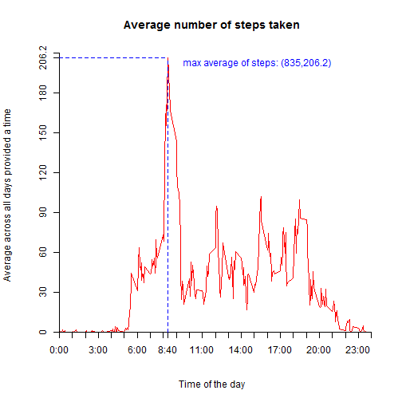
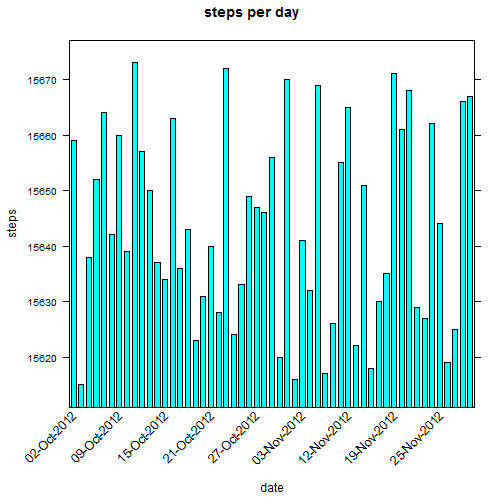
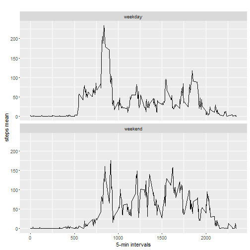

@@ -8,18 +8,123 @@ output:

## Loading and preprocessing the data

1. Load the data (i.e. read.csv())


```r
setwd("F:/DataScientist/R/repdata_data_activity")
#packages required are "plyr", "lattice", "data.table", "httr", "ggplot2"

library(plyr)
library(lattice)
library(httr)
library(ggplot2)
library(data.table)
```

```
## data.table 1.9.6  For help type ?data.table or https://github.com/Rdatatable/data.table/wiki
```

```
## The fastest way to learn (by data.table authors): https://www.datacamp.com/courses/data-analysis-the-data-table-way
```

```r
activity <- read.table(file = "activity.csv", header = TRUE, sep = ",")
```

2. Process/transform the data (if necessary) into a format suitable for your analysis (Not necessary)

## What is mean total number of steps taken per day?

1. Calculate the total number of steps taken per day
2. If you do not understand the difference between a histogram and a barplot, research the difference between them. Make a histogram of the total number of steps taken each day
3. Calculate and report the mean and median of the total number of steps taken per day


```r
activity$fetch <- as.POSIXct(with(activity, paste(date, paste(interval %/% 100, interval %% 100, sep=":"))),
    format="%Y-%m-%d %H:%M",tz="")

values <- setNames(aggregate(steps~as.Date(date), activity, sum, na.rm = TRUE), c("date","steps"))

xaxis <- seq(1, nrow(values), by = 6)

scale <- list(x = list(rot = 45, cex = 1.0, labels = format(values$date, "%d-%b-%Y")[xaxis], at = xaxis))

barchart(date ~ steps, data = values, main = "steps per day", ylab = "steps", xlab = "date", scales = scale, horizontal = F)
```


```r
paste("mean:", mean(values$steps))
```

```
## [1] "mean: 10766.1886792453"
```

```r
paste("median:", median(values$steps))
```

```
## [1] "median: 10765"
```


## What is the average daily activity pattern?

1. Make a time series plot (i.e. type = "l") of the 5-minute interval (x-axis) and the average number of steps taken, averaged across all days (y-axis)
2. Which 5-minute interval, on average across all the days in the dataset, contains the maximum number of steps?
 


```r
question2 <- aggregate(steps ~ interval, data = activity, FUN = mean)
plot(question2, type = "l", axes = F, xlab = "Time of the day", 
    ylab = "Average across all days provided a time", main = "Average number of steps taken", 
    col = "red")
axis(1,at=c(seq(0,2400,100),835), label = paste(c(seq(0,24,1),8),c(rep(":00",25),":40"),sep=""), pos = 0)
axis(2, at=c(seq(0,210,30),206.2), label = c(seq(0,210,30),206.2), pos = 0)
maximumm <- which.max(question2$steps)
segments(832, 0, 835, 206.2, col = "blue", lty = "dashed")
text(835,200, "max average of steps: (835,206.2)", col = "blue", adj = c(-.1, -.1))
segments(0, 206.2, 835, 206.2, col = "blue", lty = "dashed")
```



```r
question2 [maximumm, ]
```

```
##     interval    steps
## 104      835 206.1698
```

```r
paste(835, ", and the maximum is reached at 8:40 am")
```

```
## [1] "835 , and the maximum is reached at 8:40 am"
```

## Inputing missing values

1. Calculate and report the total number of missing values in the dataset (i.e. the total number of rows with NAs)
2. Devise a strategy for filling in all of the missing values in the dataset. The strategy does not need to be sophisticated. For example, you could use the mean/median for that day, or the mean for that 5-minute interval, etc.
3. Create a new dataset that is equal to the original dataset but with the missing data filled in.
4. Make a histogram of the total number of steps taken each day and Calculate and report the mean and median total number of steps taken per day. Do these values differ from the estimates from the first part of the assignment? What is the impact of imputing missing data on the estimates of the total daily number of steps?


```r
paste("missing observations:", sum(is.na(activity$steps)))
```

```
## [1] "missing observations: 2304"
```

```r
Question3 <- activity
Question3[is.na(activity$steps), ]$steps <- mean(activity$steps)

Question3$fetch <- as.POSIXct(with(Question3, paste(date, paste(interval %/% 100, interval %% 100, sep=":"))),
    format="%Y-%m-%d %H:%M",tz="")

pattern <- setNames(aggregate(steps~as.Date(date), Question3, sum, na.rm = TRUE), c("date","steps"))

xaxis <- seq(1, nrow(pattern), by = 6)

okscale2 <- list(x = list(rot = 45, cex = 1.0, labels = format(pattern$date, "%d-%b-%Y")[xaxis], at = xaxis))

barchart(date ~ steps, data = pattern, main = "steps per day", ylab = "steps", xlab = "date", scales = okscale2, horizontal = F)
```



```r
paste("mean:", mean(pattern$steps))
```

```
## [1] "mean: 10766.1886792453"
```

```r
paste("median:", median(pattern$steps))
```

```
## [1] "median: 10765"
```

```r
paste("means difference:", mean(pattern$steps)-mean(pasospordia$steps))
```

```
## Error in mean(pasospordia$steps): object 'pasospordia' not found
```

```r
paste("medians difference:", median(pattern$steps)-median(pasospordia$steps))
```

```
## Error in median(pasospordia$steps): object 'pasospordia' not found
```


## Are there differences in activity patterns between weekdays and weekends?

1. Create a new factor variable in the dataset with two levels – “weekday” and “weekend” indicating whether a given date is a weekday or weekend day.
2. Make a panel plot containing a time series plot (i.e. type = "l") of the 5-minute interval (x-axis) and the average number of steps taken, averaged across all weekday days or weekend days (y-axis). See the README file in the GitHub repository to see an example of what this plot should look like using simulated data.

	  

```r
str(Question3)
```

```
## 'data.frame':	17568 obs. of  4 variables:
##  $ steps   : num  NA NA NA NA NA NA NA NA NA NA ...
##  $ date    : Factor w/ 61 levels "2012-10-01","2012-10-02",..: 1 1 1 1 1 1 1 1 1 1 ...
##  $ interval: int  0 5 10 15 20 25 30 35 40 45 ...
##  $ fetch   : POSIXct, format: "2012-10-01 00:00:00" "2012-10-01 00:05:00" ...
```

```r
Question3$date <- as.Date(Question3$date, "%Y-%m-%d")
Question3$day <- weekdays(Question3$date)
Question3$tipodia <- c("weekday")
for (i in 1:nrow(Question3)){
  if (Question3$day[i] == "Saturday" || Question3$day[i] == "Sunday"){
    Question3$tipodia[i] <- "weekend"
  }
}
Question3$tipodia <- as.factor(Question3$tipodia)
semana_o_finde <- aggregate(steps ~ interval+tipodia, Question3, mean)
qplot(interval, steps, data=semana_o_finde, geom=c("line"), xlab="5-min intervals", 
      ylab="steps mean", main="") + facet_wrap(~ tipodia, ncol=1)
```


